# 📊 Alur Sistem Manajemen Klub Renang

Dokumen ini menjelaskan alur kerja setiap fitur dalam sistem.
Untuk info akun demo dan cara menjalankan, lihat [README.md](../README.md).

---

## 📌 Daftar Alur

| No | Alur | Aktor |
|----|------|-------|
| 1 | [Pendaftaran Siswa Baru](#1-pendaftaran-siswa-baru) | Calon Siswa + Admin |
| 2 | [Login & Akses Role](#2-login--akses-role) | Semua User |
| 3 | [Setup Kelas & Coach](#3-setup-kelas--coach) | Admin |
| 4 | [Sesi Latihan & Kehadiran](#4-sesi-latihan--kehadiran) | Admin + Coach |
| 5 | [Catatan Latihan](#5-catatan-latihan) | Coach + Admin |
| 6 | [Catatan Waktu Lomba & Personal Best](#6-catatan-waktu-lomba--personal-best) | Admin + Coach |
| 7 | [Penilaian & Rapor Siswa](#7-penilaian--rapor-siswa) | Coach + Admin |
| 8 | [Iuran & Keuangan](#8-iuran--keuangan) | Admin |
| 9 | [Jersey](#9-jersey) | Admin + Siswa |
| 10 | [Export Laporan](#10-export-laporan) | Admin |
| 11 | [Import Siswa Massal](#11-import-siswa-massal) | Admin |

---

## 1. Pendaftaran Siswa Baru

> Calon siswa mendaftar secara mandiri, lalu admin melakukan review.

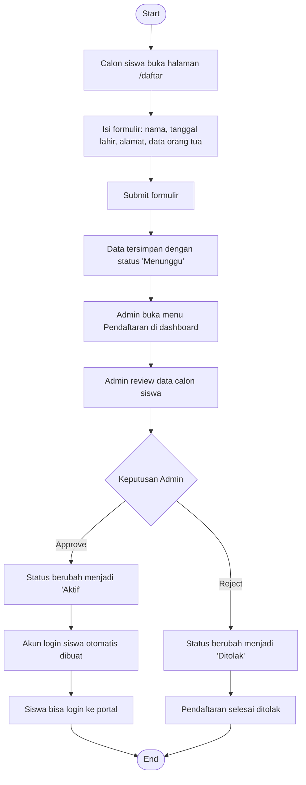

**Halaman terkait:**
- `/daftar` — form pendaftaran publik
- `/cek-status` — cek status pendaftaran
- `/admin/pendaftaran` — review oleh admin

---

## 2. Login & Akses Role

> Setiap role diarahkan ke dashboard yang berbeda setelah login.

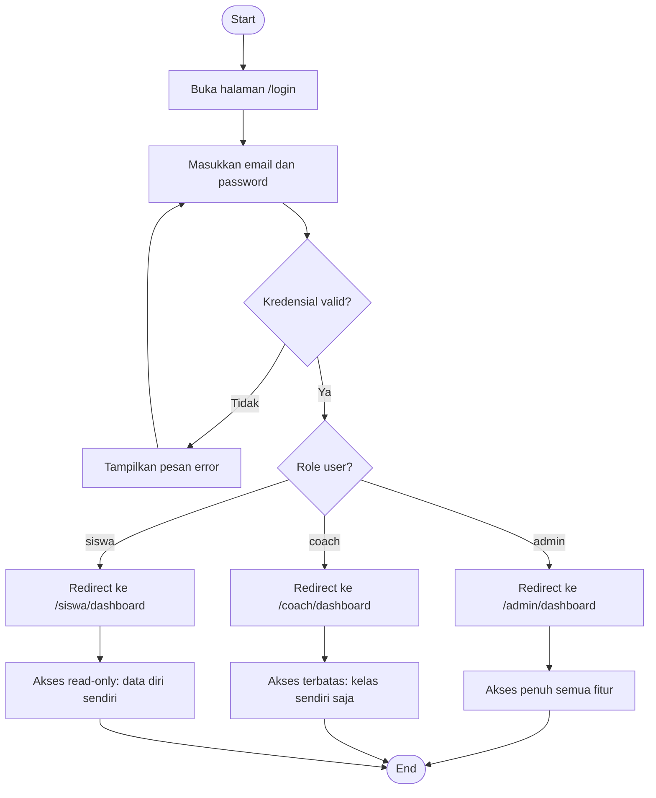

**Akun demo:**
| Role | Email | Password |
|------|-------|----------|
| Admin | admin@renang.com | password |
| Coach | coach1@renang.com | password |
| Siswa | siswa1@renang.com | password |

---

## 3. Setup Kelas & Coach

> Admin membuat kelas dan menugaskan coach serta siswa ke dalamnya.

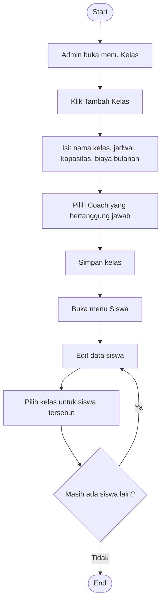

---

## 4. Sesi Latihan & Kehadiran

> Sesi dibuat terlebih dahulu, lalu kehadiran diisi saat latihan berlangsung.

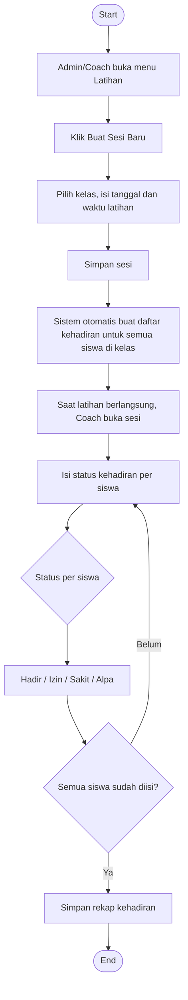

---

## 5. Catatan Latihan

> Coach mencatat performa siswa saat latihan berlangsung.

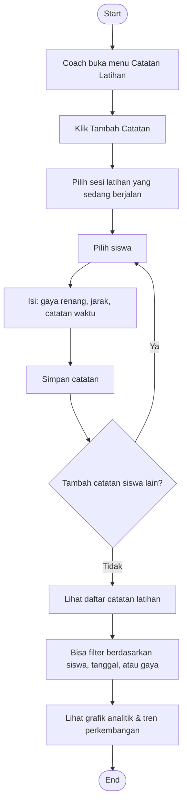

---

## 6. Catatan Waktu Lomba & Personal Best

> Setiap catatan waktu lomba yang lebih baik akan otomatis memperbarui Personal Best.

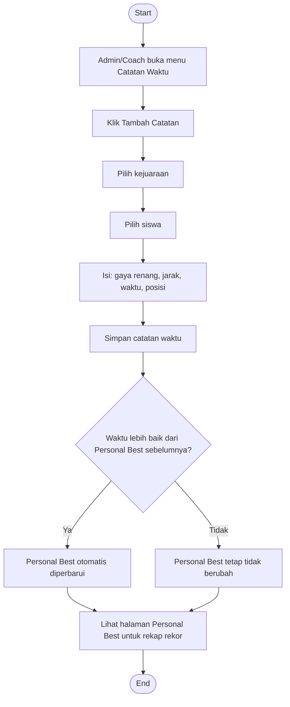

---

## 7. Penilaian & Rapor Siswa

> Coach menilai siswa per periode, sistem menghitung grade otomatis.

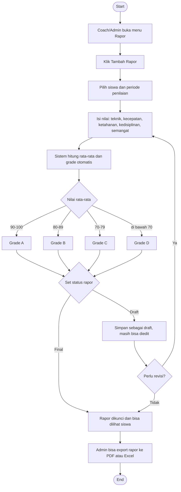

---

## 8. Iuran & Keuangan

> Admin mengelola semua tagihan dan mencatat pembayaran siswa.

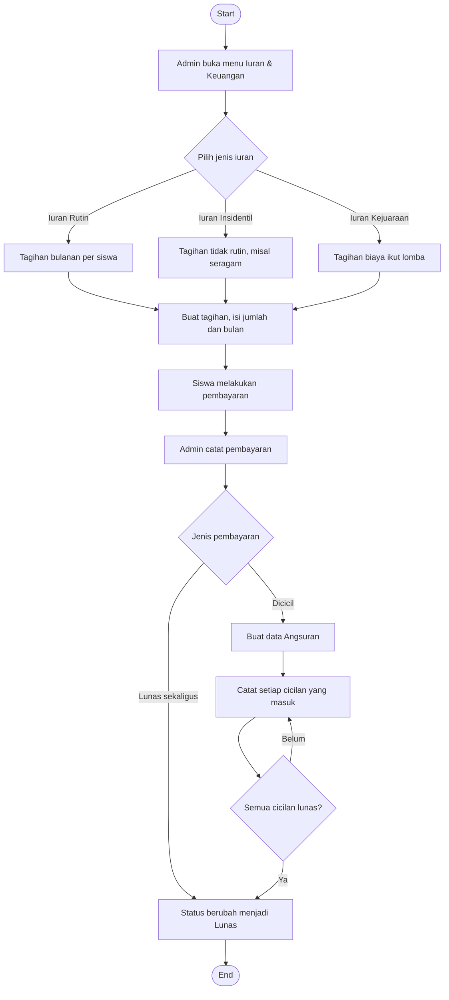

---

## 9. Jersey

> Admin membuat pesanan jersey, siswa bisa memantau statusnya.

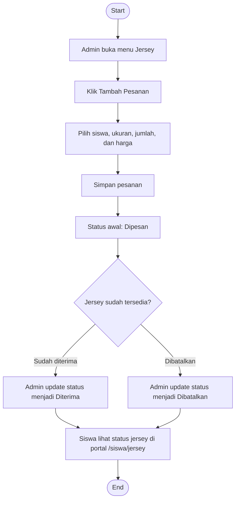

---

## 10. Export Laporan

> Admin bisa mengekspor berbagai laporan dalam format PDF atau Excel.

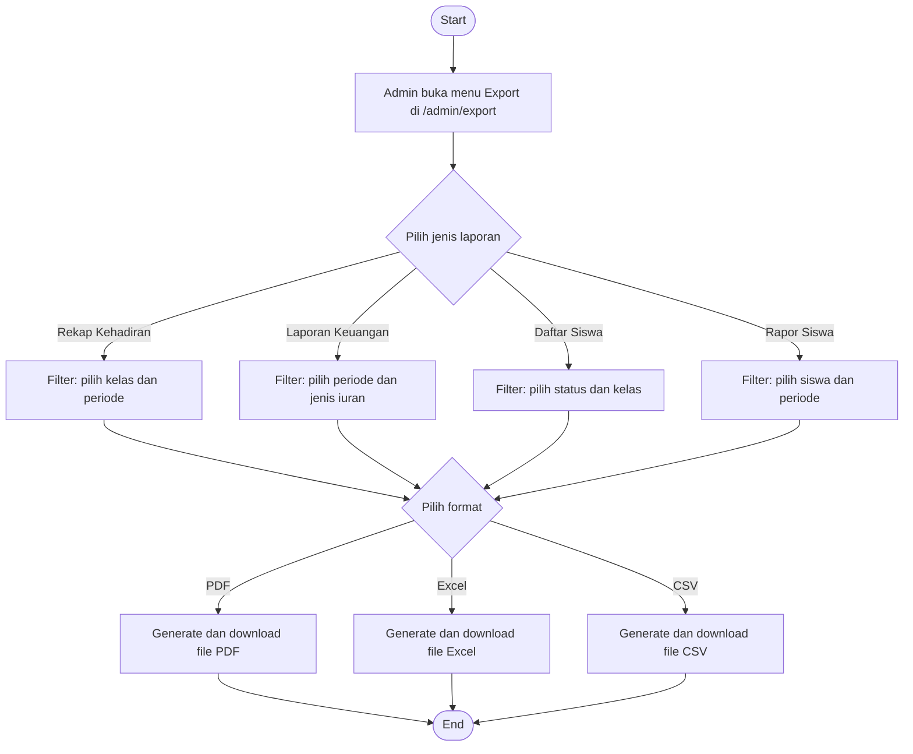

---

## 11. Import Siswa Massal

> Admin bisa menambahkan banyak siswa sekaligus menggunakan file CSV.

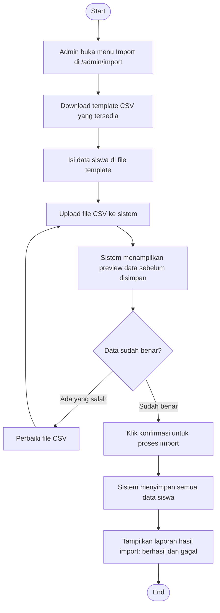

---

> 💡 **Tips:** Semua flowchart di atas bisa dirender menjadi diagram visual di VS Code (ekstensi Markdown Preview Mermaid), GitHub, atau Obsidian.
