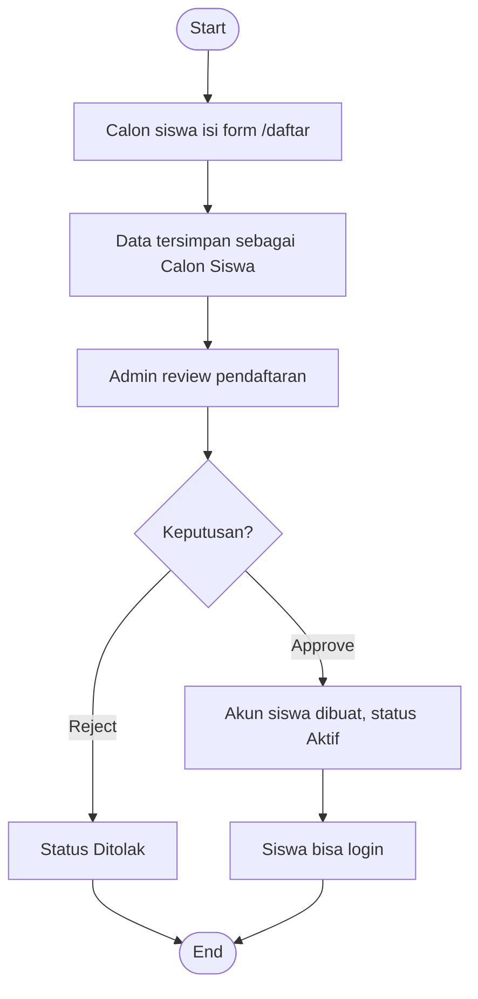
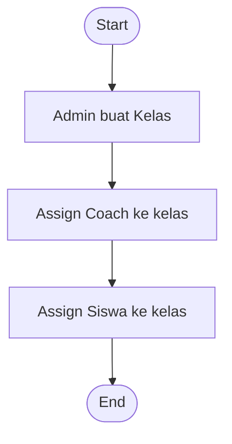
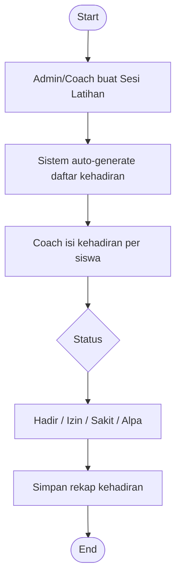
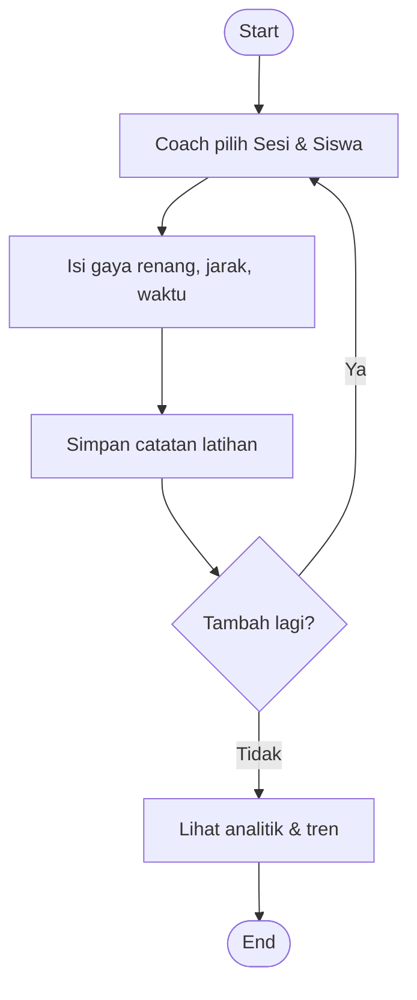
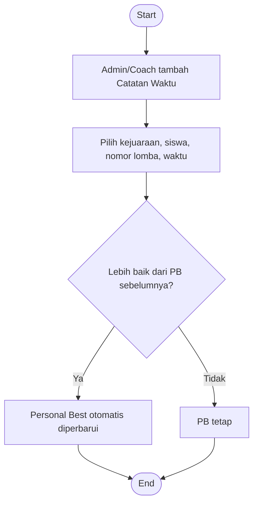
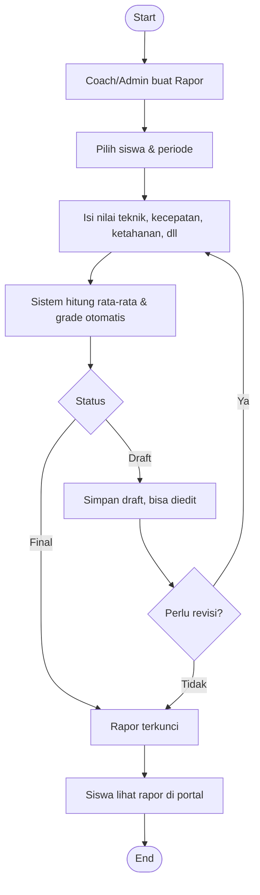
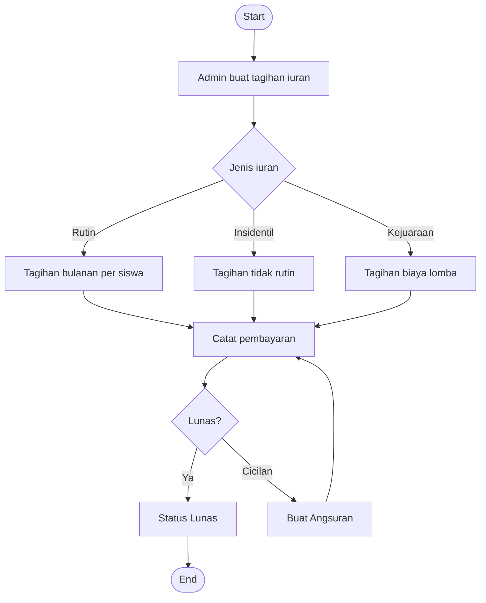
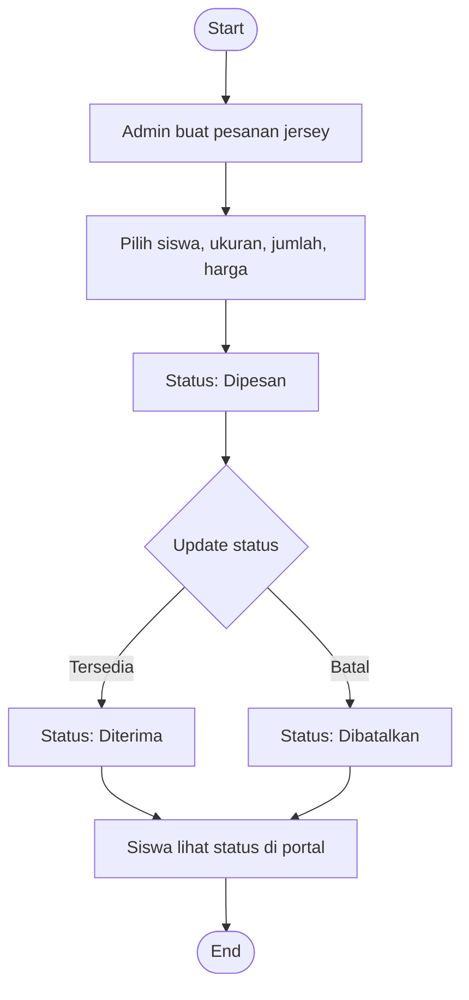
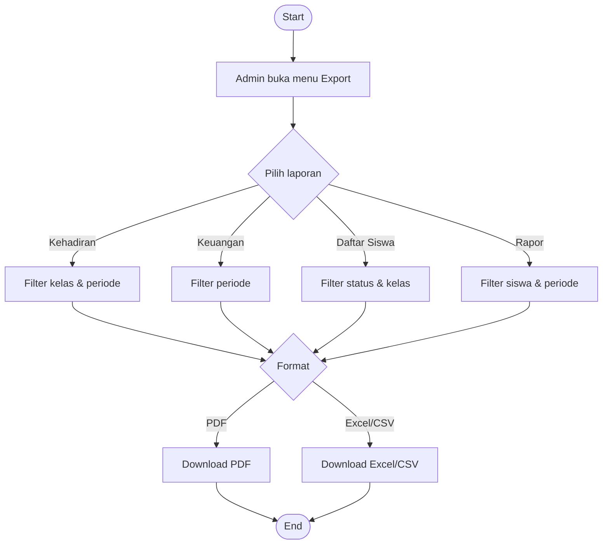

# Alur Sistem Manajemen Klub Renang

---

## 1. Pendaftaran Siswa Baru



---

## 2. Setup Kelas & Coach



---

## 3. Sesi Latihan & Kehadiran



---

## 4. Catatan Latihan



---

## 5. Catatan Waktu Lomba & Personal Best



---

## 6. Rapor Siswa



---

## 7. Iuran & Keuangan



---

## 8. Jersey



---

## 9. Export Laporan



---

## 10. Login & Akses Role

```mermaid
flowchart TD
    A([Start]) --> B[Input email & password]
    B --> C{Login berhasil?}
    C -->|Tidak| D[Tampilkan error]
    D --> B
    C -->|Ya| E{Role?}
    E -->|Admin| F[/admin/dashboard — akses penuh]
    E -->|Coach| G[/coach/dashboard — kelas sendiri]
    E -->|Siswa| H[/siswa/dashboard — read only]
    F --> I([End])
    G --> I
    H --> I
```
